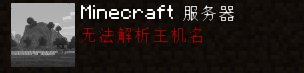

# 常见问题

## 登入失败：无效会话（请尝试重启游戏及启动器） 

（原因：玩家与认证服务器断开导致）解决：将启动器上的账户删除并重新添加账户再进入游戏即可解决 PS:**首先你需要先确定你是用皮肤站登陆进入**

## Unknown host（**界面显示无法解析主机**） 

[【win7百度版教程链接】 ](https://jingyan.baidu.com/article/f71d60375584591ab641d13c.html)[【win10百度版教程链接】](https://jingyan.baidu.com/article/2fb0ba40833b0a00f2ec5f28.html)

* 一者服务器没开、二本地设置问题、三是你的DNS的问题、四网络设置问题

1. 本地设置问题

* 先进入一遍单人世界，进入退出再进多人，这样就可以解决你的问题了.

1. DNS问题

* 首先你要找到DNS在哪修改（自行百度），选中 `Internet 协议版本 4（TCP/IPv4）`，再点 `属性`，选中 `使用下面的DNS服务器地址`，填写首选DNS服务器（根据你的网络服务提供商以及所在的城市百度搜索）和备用DNS服务器推荐：
* 然后点击 确定。至此DNS修改完毕

1. 网络设置问题

* 打开电脑的CMD（管理员）输入`netsh winsock reset`（按回车键执行命令），然后重启电脑

## 认证服务器处于宕机状态中。请稍后重试抱歉！ 

* 更新JAVA并启用它，这是你JAVA版本过低导致的，可以[**\[点我下载最新JAVA\]** (opens new window)](https://en.vessoft.com/software/windows/download/java)
* 或者将启动器上的账户删除并重新添加账户再进入游戏
* 这个可能是认证服务器处于高峰期（网络拥堵、网站维护等）导致的，你可稍等片刻

## Error occurred while contaoting login servers, are they down? 

* 你需要重新登录启动器上的账户并重启游戏即可

## 无法验证用户名

* Not authenticated with Minecraft.net
* 登入失败:Null

* 请使用**正版账户**或**微软账户**（需购买JAVA版我的世界）
* 或者使用我们 [**VLssuSKIN 皮肤站**](broken-reference) 进行登录（**离线用户注册账户并验证邮箱后**就可以和**正版一样游玩我们的服务器**）

## 如果没有你遇到的问题可以在QQ群中询问我们 


[Broken link](broken-reference)

