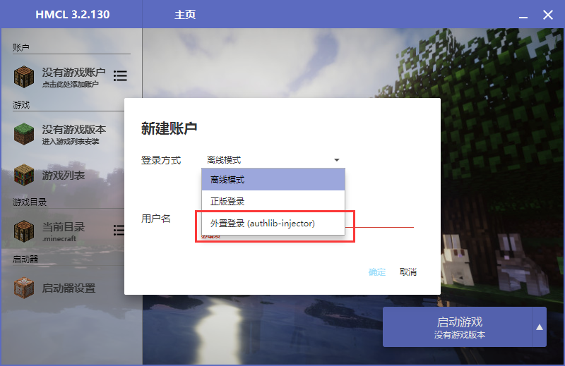
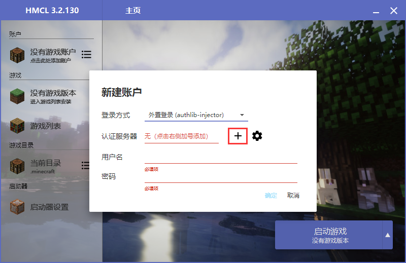
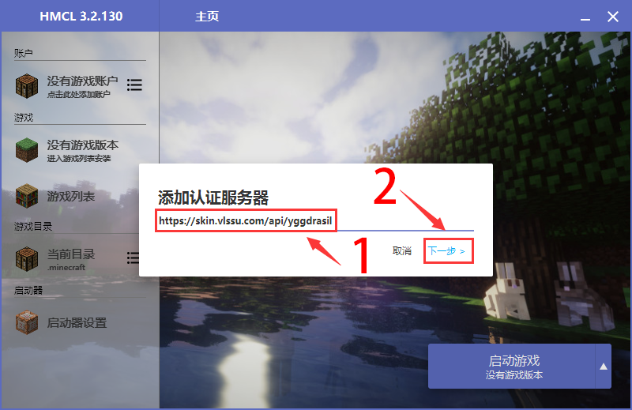
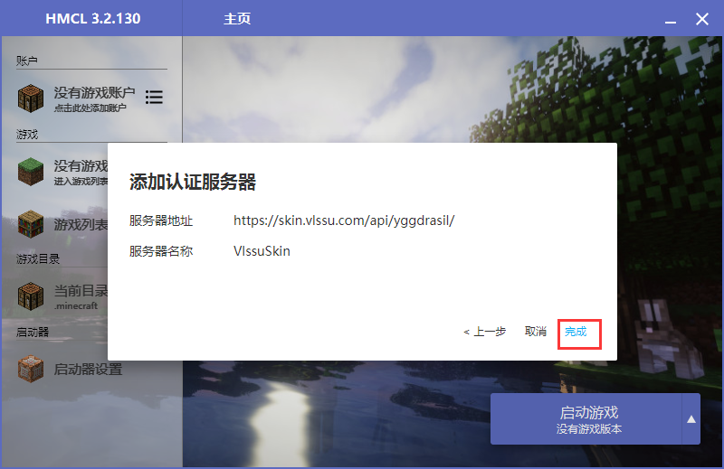
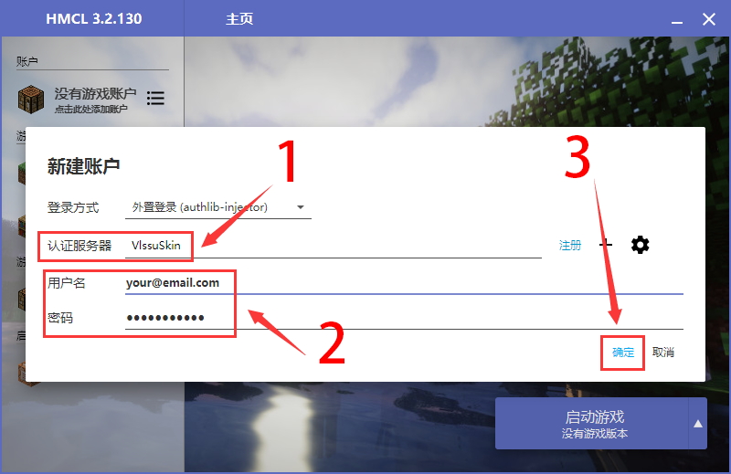

# HMCL启动器


 以下以 [HMCL 3](https://ci.huangyuhui.net/job/HMCL/) 为例，演示在 Minecraft 客户端中使用 Yggdrasil



打开 HMCL 3 的「新建游戏账户」界面，选择登陆方式为「外置登录（authlib-injector）」。 如果这是你第一次打开 HMCL，这个界面将会在启动时弹出



点击「认证服务器」旁的加号「+」，输入 VlssuSkin 的 Yggdrasil API 地址，点击「下一步」，等待识别出 VlssuSkin 的 Yggdrasil 后点击「完成」。 如果你曾经添加过 VlssuSkin 的 Yggdrasil，你也可以在「认证服务器」菜单中直接选择 VlssuSkin



在「认证服务器」菜单中选择 VlssuSkin，填写你的邮箱和密码。「用户名」即为你在 VlssuSkin 的账号的邮箱。 如果你只添加了一个认证服务器，那么 HMCL 3 会默认选中那个唯一的认证服务器


### 设置完成啦！你可以启动游戏了

