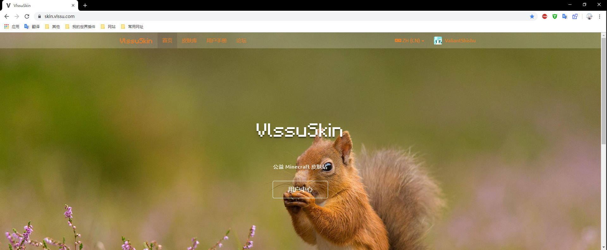
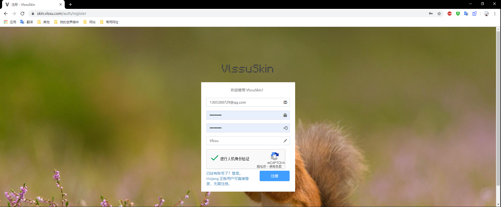
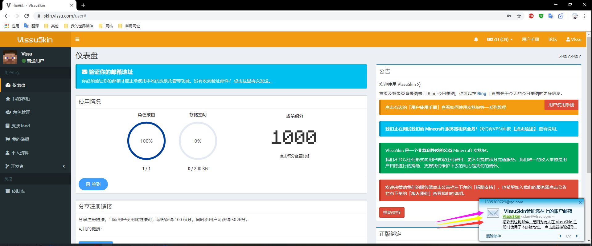

# 如何注册皮肤站

### 首先进入皮肤站

### 进行注册


理论上所有邮箱你都可以用来注册，但我们为了方便管理，请尽量用QQ邮箱



**注意！！** 正版无需注册，直接输入正版账户就完成了注册（并且皮肤、ID都会帮你配置好）



你需要验证邮箱，否则你将无法使用账户



你的ID已在你注册时填写过了，你也可以按需求去皮肤库选皮肤或自己上传皮肤



那么这部分就讲完了，如果你需要皮肤站的详细说明，那么你可以去[**皮肤站用户使用手册**](https://skin.vlssu.com/manual/)去查看更详细的内容


